# TurboAir Quotes (TAQuotes) - Complete System Architecture

## Comprehensive Architecture Diagram with Technical Explanations

```mermaid
graph TB
    %% Styling
    classDef frontend fill:#E3F2FD,stroke:#1976D2,stroke-width:3px,color:#000
    classDef backend fill:#FFF3E0,stroke:#F57C00,stroke-width:3px,color:#000
    classDef security fill:#FFEBEE,stroke:#D32F2F,stroke-width:3px,color:#000
    classDef state fill:#F3E5F5,stroke:#7B1FA2,stroke-width:3px,color:#000
    classDef ui fill:#E8F5E9,stroke:#388E3C,stroke-width:3px,color:#000
    classDef data fill:#FFF8E1,stroke:#FBC02D,stroke-width:3px,color:#000
    classDef service fill:#E0F2F1,stroke:#00796B,stroke-width:3px,color:#000
    classDef external fill:#FCE4EC,stroke:#C2185B,stroke-width:3px,color:#000

    %% Main System Entry
    User[👤 User<br/>Sales Rep/Admin]:::ui

    %% Frontend Layer
    subgraph Frontend["🖥️ FRONTEND (Client-Side)"]
        direction TB

        subgraph UILayer["📱 User Interface Layer"]
            direction LR

            subgraph Screens["🖼️ App Screens"]
                Home[🏠 Home Screen<br/>Dashboard & Metrics]:::ui
                Products[📦 Products Screen<br/>835+ Items Catalog]:::ui
                Clients[👥 Clients Screen<br/>Customer Database]:::ui
                Quotes[📋 Quotes Screen<br/>Quote Management]:::ui
                Cart[🛒 Cart Screen<br/>Order Builder]:::ui
                Stock[📊 Stock Dashboard<br/>16 Warehouses]:::ui
                Spare[🔧 Spare Parts<br/>94 Components]:::ui
                Admin[⚙️ Admin Panel<br/>System Control]:::ui
                Profile[👤 Profile<br/>User Settings]:::ui
            end

            subgraph Widgets["🎨 UI Components"]
                Forms[📝 Smart Forms<br/>Auto-validation]:::ui
                Tables[📊 Data Tables<br/>Sortable/Filterable]:::ui
                Charts[📈 Charts<br/>Visual Analytics]:::ui
                Images[🖼️ Image Gallery<br/>3,534 CDN Images]:::ui
            end
        end

        subgraph StateManagement["🔄 State Management (Riverpod)"]
            direction LR

            Provider[📡 Provider<br/>Data Exposure Pattern<br/><i>Makes data available<br/>to UI widgets</i>]:::state
            StreamProvider[🌊 StreamProvider<br/>Real-time Updates<br/><i>Auto-refreshes when<br/>Firebase changes</i>]:::state
            StateNotifier[🎛️ StateNotifier<br/>Complex State Logic<br/><i>Manages form states<br/>& validations</i>]:::state
            AutoDispose[♻️ AutoDispose<br/>Memory Management<br/><i>Cleans up when<br/>screen closes</i>]:::state

            Provider --> StreamProvider
            StreamProvider --> StateNotifier
            StateNotifier --> AutoDispose
        end

        subgraph LocalStorage["💾 Local Storage"]
            Hive[📦 Hive DB<br/>100MB Cache<br/><i>Works offline</i>]:::data
            SharedPrefs[⚙️ SharedPrefs<br/>User Settings<br/><i>Remember choices</i>]:::data
            ImageCache[🖼️ Image Cache<br/>Fast Loading<br/><i>No re-downloads</i>]:::data
        end

        subgraph Navigation["🗺️ Navigation (GoRouter)"]
            Routes[🛣️ Route Guards<br/>Auth Check<br/><i>Login required</i>]:::frontend
            DeepLinks[🔗 Deep Links<br/>Direct Access<br/><i>Share URLs</i>]:::frontend
            NavBar[📱 Nav Bar<br/>9 Main Sections<br/><i>Quick access</i>]:::frontend
        end
    end

    %% Backend Layer
    subgraph Backend["☁️ BACKEND (Server-Side)"]
        direction TB

        subgraph Firebase["🔥 Firebase Services"]
            direction LR

            Auth[🔐 Firebase Auth<br/>User Login<br/><i>Secure access</i>]:::backend
            RealtimeDB[💾 Realtime DB<br/>Instant Sync<br/><i>Live updates</i>]:::backend
            Storage[☁️ Cloud Storage<br/>3,534 Images<br/><i>CDN delivery</i>]:::backend
            Hosting[🌐 Web Hosting<br/>taquotes.web.app<br/><i>Global access</i>]:::backend

            Auth --> RealtimeDB
            RealtimeDB --> Storage
            Storage --> Hosting
        end

        subgraph DatabaseCollections["📚 Database Collections"]
            direction LR

            ProductsDB[(📦 Products<br/>835 items<br/>SKU/Price/Stock)]:::data
            ClientsDB[(👥 Clients<br/>1000+ customers<br/>Contact info)]:::data
            QuotesDB[(📋 Quotes<br/>10,000+ quotes<br/>Order history)]:::data
            UsersDB[(👤 Users<br/>500+ sales reps<br/>Profiles/Roles)]:::data
            SparePartsDB[(🔧 Spare Parts<br/>94 components<br/>Inventory)]:::data
            WarehouseDB[(📦 Warehouses<br/>16 locations<br/>Stock levels)]:::data
        end

        subgraph ExternalServices["🌐 External Services"]
            Email[📧 Gmail SMTP<br/>Quote Emails<br/><i>PDF attachments</i>]:::external
            PDFGen[📄 PDF Generator<br/>Professional Quotes<br/><i>Branded docs</i>]:::external
            ExcelExp[📊 Excel Export<br/>Spreadsheets<br/><i>Analysis ready</i>]:::external
            Backup[💾 Backup Service<br/>Daily Backups<br/><i>Data safety</i>]:::external
        end
    end

    %% Security Layer
    subgraph Security["🔒 Security & Access Control"]
        direction LR

        RBAC[👮 Role-Based Access<br/>Admin/Sales/Distributor<br/><i>Permission levels</i>]:::security
        CSRF[🛡️ CSRF Protection<br/>Token Validation<br/><i>Prevent attacks</i>]:::security
        RateLimit[⏱️ Rate Limiting<br/>API Throttling<br/><i>Stop abuse</i>]:::security
        Session[⏰ Session Timeout<br/>30 min auto-logout<br/><i>Security measure</i>]:::security
        Validation[✅ Input Validation<br/>Data Sanitization<br/><i>Prevent injection</i>]:::security

        RBAC --> CSRF
        CSRF --> RateLimit
        RateLimit --> Session
        Session --> Validation
    end

    %% Business Logic Layer
    subgraph BusinessLogic["⚙️ Business Services"]
        direction LR

        CartService[🛒 Cart Service<br/>Order Processing<br/><i>Tax calculation</i>]:::service
        QuoteService[📋 Quote Service<br/>Quote Generation<br/><i>Numbering system</i>]:::service
        StockService[📊 Stock Service<br/>Inventory Tracking<br/><i>16 warehouses</i>]:::service
        EmailService[📧 Email Service<br/>Notifications<br/><i>Customer comms</i>]:::service
        OfflineService[📴 Offline Service<br/>Queue Management<br/><i>Sync when online</i>]:::service

        CartService --> QuoteService
        QuoteService --> StockService
        StockService --> EmailService
        EmailService --> OfflineService
    end

    %% Connections - User Flow
    User -->|1. Opens App| Frontend
    User -->|2. Login| Auth

    %% Frontend Internal Connections
    Home --> StateManagement
    Products --> StateManagement
    Clients --> StateManagement
    Quotes --> StateManagement
    Cart --> StateManagement
    Stock --> StateManagement
    Spare --> StateManagement
    Admin --> StateManagement
    Profile --> StateManagement

    StateManagement --> LocalStorage
    StateManagement --> BusinessLogic

    Forms --> StateManagement
    Tables --> StateManagement
    Charts --> StateManagement
    Images --> Storage

    Routes --> Security
    DeepLinks --> Routes
    NavBar --> Routes

    %% Backend Connections
    BusinessLogic --> Firebase
    BusinessLogic --> ExternalServices

    RealtimeDB --> ProductsDB
    RealtimeDB --> ClientsDB
    RealtimeDB --> QuotesDB
    RealtimeDB --> UsersDB
    RealtimeDB --> SparePartsDB
    RealtimeDB --> WarehouseDB

    %% Security Connections
    Auth --> RBAC
    Frontend --> Security
    Backend --> Security

    %% Service Connections
    CartService --> Cart
    QuoteService --> Quotes
    StockService --> Stock
    EmailService --> Email
    OfflineService --> Hive

    %% External Service Connections
    QuoteService --> PDFGen
    QuoteService --> ExcelExp
    Admin --> Backup
```

## 📖 Technical Terms Explained for Non-Technical Users

### State Management Concepts

| Term | What It Means | Real-World Analogy |
|------|---------------|-------------------|
| **Provider** | A way to share data between screens | Like a bulletin board everyone can read |
| **StreamProvider** | Auto-updating data from server | Like a live news feed that updates itself |
| **Reactive Stream** | Data that automatically refreshes | Like a stock ticker showing real-time prices |
| **State Persistence** | Remembering data when app closes | Like bookmarking your page in a book |
| **AutoDispose** | Automatic cleanup of unused data | Like auto-closing tabs to save memory |
| **StateNotifier** | Manages complex form logic | Like a smart form that knows what's valid |
| **Riverpod** | The state management system | Like the nervous system of the app |

### Architecture Components

| Component | Purpose | User Benefit |
|-----------|---------|--------------|
| **Frontend** | What users see and interact with | Beautiful, responsive interface |
| **Backend** | Server and database operations | Secure data storage and processing |
| **CDN (Content Delivery Network)** | Fast image delivery worldwide | Images load quickly from anywhere |
| **Firebase** | Google's cloud platform | Real-time updates, secure storage |
| **JWT (JSON Web Token)** | Secure login tokens | Stay logged in securely |
| **RBAC (Role-Based Access Control)** | Permission system | Users only see what they're allowed to |
| **CSRF Protection** | Prevents fake requests | Protects against hackers |
| **Rate Limiting** | Limits request frequency | Prevents system overload |
| **Offline Mode** | Works without internet | Continue working anywhere |
| **Hot Reload** | Instant code updates | Faster development and fixes |

### Data Flow Explanation

1. **User Action** → User clicks a button or enters data
2. **UI Layer** → Screen captures the interaction
3. **State Management** → Riverpod processes the change
4. **Business Logic** → Calculates taxes, validates data
5. **Backend Service** → Saves to Firebase database
6. **Real-time Sync** → Updates all connected devices
7. **UI Update** → Screen shows the new information

### Security Layers

1. **Authentication** - Verify who you are (login)
2. **Authorization** - Check what you can do (permissions)
3. **Validation** - Ensure data is correct (no errors)
4. **Encryption** - Scramble data for safety (privacy)
5. **Rate Limiting** - Prevent too many requests (stability)
6. **Session Timeout** - Auto-logout after inactivity (security)

## 🎯 Key Features by User Type

### Sales Representatives
- Create quotes for customers
- Manage client database
- Check real-time stock
- Generate PDF quotes
- Track quote history

### Administrators
- Monitor user performance
- Manage warehouse stock
- View analytics dashboards
- Control system settings
- Approve new users

### Distributors
- View product catalog
- Check stock availability
- Create bulk orders
- Export to Excel
- Track shipments

## 📊 System Metrics

- **Products**: 835+ items in catalog
- **Images**: 3,534 product images on CDN
- **Warehouses**: 16 global locations
- **Spare Parts**: 94 components tracked
- **Users**: 500+ active sales reps
- **Quotes**: 1,000+ monthly quotes
- **Uptime**: 99.9% availability
- **Performance**: <2 second load times
- **Offline Cache**: 100MB local storage
- **Platforms**: Web, Android, iOS, Windows

## 🔄 Connected vs Non-Connected IDE

| Feature | Connected IDE | Non-Connected |
|---------|--------------|---------------|
| **Hot Reload** | ✅ Instant updates | ❌ Requires rebuild |
| **Debugging** | ✅ Step through code | ❌ Console logs only |
| **Performance** | ✅ Real-time profiling | ❌ Post-analysis |
| **Testing** | ✅ Live testing | ❌ Manual testing |
| **Development Speed** | 10x faster | Normal speed |