# TurboAir Quotes - Non-Technical Architecture (Improved Layout)

## System Overview - Hierarchical View

```mermaid
graph TD
    Start[🌐 TurboAir Quotes System<br/>━━━━━━━━━<br/>Web App: taquotes.web.app<br/>835 Products • 500+ Clients<br/>94 Spare Parts • 16 Warehouses]

    Start --> Frontend[🎨 FRONTEND<br/>━━━━━━━━━<br/>What Users See<br/>Runs in Browser/Device]
    Start --> Backend[⚙️ BACKEND<br/>━━━━━━━━━<br/>Behind the Scenes<br/>Runs in Cloud]

    %% Frontend Branch
    Frontend --> UserFlow[👤 User Flow]
    Frontend --> Screens[📱 App Screens]
    Frontend --> Memory[💾 App Memory]

    %% User Flow Details
    UserFlow --> UF1[1️⃣ Visit Website<br/>taquotes.web.app]
    UserFlow --> UF2[2️⃣ Login with Email<br/>Stay logged 30 days]
    UserFlow --> UF3[3️⃣ Browse Products<br/>835 items available]
    UserFlow --> UF4[4️⃣ Add to Cart<br/>Build your quote]
    UserFlow --> UF5[5️⃣ Select Client<br/>500+ customers]
    UserFlow --> UF6[6️⃣ Generate Quote<br/>Professional PDF]
    UserFlow --> UF7[7️⃣ Send Email<br/>With attachments]

    %% Screens Branch
    Screens --> AuthScreens[🔐 Login Screens]
    Screens --> MainScreens[📊 Main Features]
    Screens --> AdminScreens[🛡️ Admin Only]

    AuthScreens --> Login[Login Screen<br/>• Email/Password<br/>• Remember Me<br/>• Forgot Password]
    AuthScreens --> Register[Register Screen<br/>• New Account<br/>• Email Verify<br/>• Role Selection]

    MainScreens --> Home[🏠 Home<br/>• Dashboard<br/>• Metrics<br/>• Quick Actions]
    MainScreens --> Products[📦 Products<br/>• 835 Items<br/>• Categories<br/>• Search/Filter]
    MainScreens --> Cart[🛒 Cart<br/>• Line Items<br/>• Discounts %/$<br/>• Tax 8%<br/>• Grand Total]
    MainScreens --> Clients[👥 Clients<br/>• 500+ Records<br/>• Add/Edit/Delete<br/>• Import/Export]
    MainScreens --> Stock[📊 Stock<br/>• 16 Warehouses<br/>• Real-time Levels<br/>• Alerts]

    AdminScreens --> AdminPanel[Admin Panel<br/>• User Management<br/>• System Settings<br/>• Database Tools]
    AdminScreens --> Performance[Performance<br/>• Sales Metrics<br/>• Conversion Rates<br/>• Reports]

    %% Memory Branch
    Memory --> LoginMem[🔐 Login Memory<br/>• 30-day Remember<br/>• Auto-logout 30min<br/>• Multi-device]
    Memory --> CartMem[🛒 Cart Memory<br/>• Items & Quantities<br/>• Discounts Applied<br/>• Client Selected]
    Memory --> DataMem[📦 Data Memory<br/>• Products Loaded<br/>• Filters Saved<br/>• Search History]

    %% Backend Branch
    Backend --> Firebase[🔥 Firebase Services]
    Backend --> Database[💾 Database]
    Backend --> Processing[🔧 Processing]

    Firebase --> Auth[🔐 Authentication<br/>• Login System<br/>• 4 Role Levels<br/>• Password Reset]
    Firebase --> Storage[📁 Cloud Storage<br/>• 3,534 Images<br/>• CDN Delivery<br/>• Fast Loading]
    Firebase --> Hosting[🌐 Web Hosting<br/>• 99.95% Uptime<br/>• SSL Security<br/>• Auto-scaling]

    Database --> DB_Products[📦 Products DB<br/>• 835 Items<br/>• SKUs & Prices<br/>• Specifications]
    Database --> DB_Clients[👥 Clients DB<br/>• 500+ Customers<br/>• Contact Info<br/>• Credit Terms]
    Database --> DB_Warehouses[🏭 Warehouses DB<br/>• 16 Locations:<br/>999, CA, CA1-4<br/>COCZ, COPZ, INT<br/>MEE, PU, SI<br/>XCA, XPU, XZRE, ZRE]
    Database --> DB_SpareParts[🔧 Spare Parts DB<br/>• 94 Components<br/>• 1,716 Units Total<br/>• Stock by Location]

    Processing --> PriceCalc[🧮 Price Calculator<br/>• Qty × Price<br/>• Tax 8%<br/>• Discounts %/$]
    Processing --> QuoteGen[📋 Quote Generator<br/>• TAQ-2025-001<br/>• PDF Creation<br/>• Digital Signature]
    Processing --> EmailSvc[📧 Email Service<br/>• Gmail SMTP<br/>• PDF Attachment<br/>• 25MB Limit]

    classDef frontendStyle fill:#e3f2fd,stroke:#1565c0,stroke-width:3px
    classDef backendStyle fill:#fff3e0,stroke:#ef6c00,stroke-width:3px
    classDef dataStyle fill:#e8f5e9,stroke:#2e7d32,stroke-width:3px
    classDef processStyle fill:#fce4ec,stroke:#c2185b,stroke-width:3px

    class Start,Frontend,UserFlow,Screens,Memory,AuthScreens,MainScreens,AdminScreens frontendStyle
    class Backend,Firebase,Auth,Storage,Hosting backendStyle
    class Database,DB_Products,DB_Clients,DB_Warehouses,DB_SpareParts dataStyle
    class Processing,PriceCalc,QuoteGen,EmailSvc processStyle
```

## Feature Details - Tabular Organization

## User Journey - Sequential Flow

```mermaid
sequenceDiagram
    participant U as User
    participant W as Website
    participant DB as Database
    participant E as Email

    U->>W: 1. Visit taquotes.web.app
    W-->>U: Show Login Screen

    U->>W: 2. Enter Email/Password
    W->>DB: Verify Credentials
    DB-->>W: Authentication OK
    W-->>U: Show Home Dashboard

    U->>W: 3. Browse Products (835 items)
    W->>DB: Load Products
    DB-->>W: Product Data
    W-->>U: Display Catalog

    U->>W: 4. Add Items to Cart
    W-->>U: Update Cart (with calculations)
    Note over W: Subtotal = Sum(Qty × Price)<br/>Tax = Subtotal × 8%<br/>Discount = % or $<br/>Total = Subtotal + Tax - Discount

    U->>W: 5. Select Client (500+ available)
    W->>DB: Load Clients
    DB-->>W: Client List
    W-->>U: Show Client Dropdown

    U->>W: 6. Generate Quote
    W->>W: Create PDF (TAQ-2025-001)
    W-->>U: Show Quote Preview

    U->>W: 7. Send Quote
    W->>E: Send Email with PDF
    E-->>E: Add to Queue
    E-->>U: Delivery Confirmation
```

## System Metrics Dashboard

## Key Features Summary

| Category | Details |
|----------|---------|
| **🛒 Cart Features** | Line items, Quantities, Prices, Discounts (% and $), Tax (8%), Client selection, Comments, Draft save |
| **📊 Stock System** | 16 warehouses (999, CA, CA1-4, COCZ, COPZ, INT, MEE, PU, SI, XCA, XPU, XZRE, ZRE), Real-time levels, Color alerts |
| **🔧 Spare Parts** | 94 components, 1,716 total units, Category filters, Stock by warehouse |
| **💰 Calculations** | Line totals (Qty × Price), Subtotal, Tax (8%), Discounts (% or $), Discount reasons, Grand total |
| **📄 Quote System** | Auto-numbering (TAQ-2025-XXX), PDF generation, Digital signature, 30-day validity, Email delivery |
| **👤 User Features** | 30-day login memory, 30-min idle timeout, 4 role levels, Multi-device support |
| **📱 Performance** | 99.95% uptime, 2-second load time, 100MB offline cache, Real-time sync |