# TurboAir Quotes - Technical Architecture (Improved Layout)

## System Architecture - Layered View

```mermaid
graph TD
    subgraph "🎯 PRESENTATION LAYER"
        UI[Flutter UI Layer<br/>━━━━━━━━━<br/>Material Design 3.0<br/>Responsive Layout]

        UI --> Screens[Screen Widgets]
        Screens --> Auth_W[🔐 Authentication<br/>LoginScreen<br/>RegisterScreen<br/>ForgotPasswordScreen]
        Screens --> Main_W[📱 Main Screens<br/>ProductsScreen<br/>CartScreen<br/>ClientsScreen<br/>QuotesScreen]
        Screens --> Admin_W[🛡️ Admin Screens<br/>AdminPanelScreen<br/>PerformanceDashboard<br/>UserManagement]

        UI --> Components[Reusable Components]
        Components --> Forms[Form Widgets<br/>TextFormField<br/>Validators<br/>Controllers]
        Components --> Lists[List Widgets<br/>ListView.builder<br/>GridView<br/>DataTable2]
        Components --> Charts[Chart Widgets<br/>fl_chart 0.63.0<br/>PieChart<br/>BarChart]
    end

    subgraph "🔄 STATE MANAGEMENT LAYER"
        State[Riverpod 2.4.9<br/>━━━━━━━━━<br/>Reactive State Management]

        State --> Providers[Provider Types]
        Providers --> Stream_P[StreamProvider<br/>autoDispose<br/>Real-time Updates]
        Providers --> State_P[StateProvider<br/>Simple State<br/>Synchronous]
        Providers --> StateNotifier_P[StateNotifierProvider<br/>Complex Logic<br/>Immutable State]

        State --> AppProviders[App Providers]
        AppProviders --> Auth_P[authStateProvider<br/>User Authentication<br/>JWT Tokens]
        AppProviders --> Cart_P[cartItemsProvider<br/>Cart Management<br/>Hive Persistence]
        AppProviders --> Product_P[productsProvider<br/>835 Products<br/>Real-time Sync]
    end

    subgraph "🏗️ BUSINESS LOGIC LAYER"
        Business[Business Services<br/>━━━━━━━━━<br/>Core Logic]

        Business --> Services
        Services --> Price_S[PriceCalculator<br/>• Line totals<br/>• Tax 8%<br/>• Discounts %/$<br/>• Grand total]
        Services --> Quote_S[QuoteGenerator<br/>• TAQ-YYYY-###<br/>• PDF creation<br/>• Signatures]
        Services --> Email_S[EmailService<br/>• SMTP Gmail<br/>• Attachments<br/>• Retry logic]
        Services --> Export_S[ExportService<br/>• Excel export<br/>• 10k limit<br/>• Formulas]
    end

    subgraph "📊 DATA LAYER"
        Data[Data Access<br/>━━━━━━━━━<br/>Firebase Integration]

        Data --> Firebase
        Firebase --> FB_Auth[Firebase Auth<br/>JWT tokens<br/>Role claims<br/>Session mgmt]
        Firebase --> FB_DB[Realtime Database<br/>WebSocket<br/>100MB cache<br/>Offline sync]
        Firebase --> FB_Storage[Cloud Storage<br/>3,534 images<br/>CDN Fastly<br/>Transformations]

        Data --> Local
        Local --> Hive_DB[Hive 2.2.3<br/>Local storage<br/>Cart persistence<br/>Preferences]
        Local --> Secure[SecureStorage<br/>Token storage<br/>Credentials<br/>Encryption]
    end

    subgraph "🔒 INFRASTRUCTURE LAYER"
        Infra[Infrastructure<br/>━━━━━━━━━<br/>Security & Performance]

        Infra --> Security
        Security --> TLS[TLS 1.3<br/>ECDHE-RSA<br/>256-bit]
        Security --> CSRF[CSRF Protection<br/>Double-submit<br/>Token rotation]
        Security --> Rate[Rate Limiting<br/>100 req/min<br/>IP tracking]

        Infra --> Performance
        Performance --> Cache[Caching<br/>100MB Hive<br/>LRU eviction]
        Performance --> Lazy[Lazy Loading<br/>24 initial<br/>+12 on scroll]
        Performance --> Metrics[Metrics<br/>FCP: 1.2s<br/>TTI: 2.1s<br/>Score: 92]
    end

    classDef uiStyle fill:#e3f2fd,stroke:#1565c0,stroke-width:3px
    classDef stateStyle fill:#f3e5f5,stroke:#6a1b9a,stroke-width:3px
    classDef businessStyle fill:#fff3e0,stroke:#ef6c00,stroke-width:3px
    classDef dataStyle fill:#e8f5e9,stroke:#2e7d32,stroke-width:3px
    classDef infraStyle fill:#ffebee,stroke:#c62828,stroke-width:3px

    class UI,Screens,Components,Auth_W,Main_W,Admin_W,Forms,Lists,Charts uiStyle
    class State,Providers,AppProviders,Stream_P,State_P,StateNotifier_P,Auth_P,Cart_P,Product_P stateStyle
    class Business,Services,Price_S,Quote_S,Email_S,Export_S businessStyle
    class Data,Firebase,Local,FB_Auth,FB_DB,FB_Storage,Hive_DB,Secure dataStyle
    class Infra,Security,Performance,TLS,CSRF,Rate,Cache,Lazy,Metrics infraStyle
```

## Database Schema - Entity Relationships

## Technical Stack - Component Details

```mermaid
graph LR
    subgraph "FRONTEND STACK"
        Flutter[Flutter 3.16.0<br/>Dart 3.2.0]
        Flutter --> Packages

        Packages --> State_Pkg[State Management<br/>• riverpod 2.4.9<br/>• provider 6.0.5]
        Packages --> UI_Pkg[UI Components<br/>• fl_chart 0.63.0<br/>• data_table_2 2.5.0<br/>• cached_network_image 3.3.0]
        Packages --> Utils_Pkg[Utilities<br/>• go_router 12.1.3<br/>• hive 2.2.3<br/>• pdf 3.10.7<br/>• excel 2.0.0<br/>• mailer 6.0.1]
    end

    subgraph "BACKEND STACK"
        Firebase[Firebase Platform]
        Firebase --> FB_Services

        FB_Services --> Core_FB[Core Services<br/>• Auth 4.15.0<br/>• Database 10.3.0<br/>• Storage 11.5.0]
        FB_Services --> Extra_FB[Additional<br/>• Hosting<br/>• Functions v2<br/>• Analytics]
    end

    subgraph "INFRASTRUCTURE"
        Cloud[Cloud Infrastructure]
        Cloud --> CDN[CDN - Fastly<br/>• 76 edge locations<br/>• Image optimization<br/>• Caching]
        Cloud --> Security_Infra[Security<br/>• TLS 1.3<br/>• WAF<br/>• DDoS protection]
        Cloud --> Monitor[Monitoring<br/>• Error tracking<br/>• Performance<br/>• Analytics]
    end

    classDef frontendStyle fill:#e3f2fd,stroke:#1565c0,stroke-width:2px
    classDef backendStyle fill:#fff3e0,stroke:#ef6c00,stroke-width:2px
    classDef infraStyle fill:#e8f5e9,stroke:#2e7d32,stroke-width:2px

    class Flutter,Packages,State_Pkg,UI_Pkg,Utils_Pkg frontendStyle
    class Firebase,FB_Services,Core_FB,Extra_FB backendStyle
    class Cloud,CDN,Security_Infra,Monitor infraStyle
```

## Code Architecture - Class Relationships

## Performance Metrics

```mermaid
graph TB
    subgraph "Performance Targets"
        Metrics[Performance Metrics]
        Metrics --> Load[Loading Times<br/>• FCP: 1.2s ✅<br/>• TTI: 2.1s ✅<br/>• LCP: 2.5s ✅]
        Metrics --> Size[Bundle Size<br/>• Total: 3.4MB<br/>• Gzipped<br/>• Code Split]
        Metrics --> Score[Lighthouse<br/>• Performance: 92<br/>• SEO: 100<br/>• A11y: 95]
    end

    subgraph "Optimization Techniques"
        Opt[Optimizations]
        Opt --> LazyOpt[Lazy Loading<br/>• Initial: 24 items<br/>• Scroll: +12<br/>• Threshold: 80%]
        Opt --> CacheOpt[Caching<br/>• Hive: 100MB<br/>• LRU eviction<br/>• Image cache]
        Opt --> CodeOpt[Code<br/>• Tree shaking<br/>• Deferred imports<br/>• Minification]
    end

    subgraph "API Performance"
        API[API Metrics]
        API --> Response[Response Times<br/>• p50: 100ms<br/>• p95: 200ms<br/>• p99: 500ms]
        API --> Database[Database<br/>• Query: <100ms<br/>• Write: <200ms<br/>• Batch: <500ms]
        API --> CDN_Perf[CDN<br/>• Image: 50ms<br/>• Cache hit: 95%<br/>• Global: 76 POPs]
    end
```

## Security Implementation

| Layer | Implementation | Details |
|-------|---------------|---------|
| **Transport** | TLS 1.3 | ECDHE-RSA-AES256-GCM-SHA384, HSTS enabled |
| **Authentication** | Firebase Auth | JWT tokens (1hr), Refresh tokens (30 days) |
| **Authorization** | RBAC | Custom claims, 4 role levels, Resource permissions |
| **Session** | Management | 30-min idle timeout, Secure cookies, Multi-device |
| **CSRF** | Protection | Double-submit cookies, SameSite=Strict, Token rotation |
| **Rate Limiting** | Throttling | 100 req/min/IP, Exponential backoff, Redis tracking |
| **Input** | Validation | Sanitization, XSS prevention, SQL injection protection |
| **Data** | Encryption | At-rest (AES), In-transit (TLS), Hive encryption |

## Warehouse Configuration

| Code | Location | Type | Stock Tracking |
|------|----------|------|----------------|
| 999 | Main Warehouse | Primary | Real-time |
| CA | California | Regional | Real-time |
| CA1-CA4 | California Sub | Sub-warehouse | Real-time |
| COCZ | Costa Rica | International | Real-time |
| COPZ | Colombia | International | Real-time |
| INT | International | Global | Real-time |
| MEE | Mexico East | Regional | Real-time |
| PU | Puebla | Regional | Real-time |
| SI | Sinaloa | Regional | Real-time |
| XCA | Export California | Export | Real-time |
| XPU | Export Puebla | Export | Real-time |
| XZRE | Export Zone Reserve | Export | Real-time |
| ZRE | Zone Reserve | Reserve | Real-time |